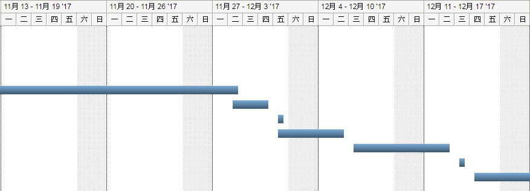
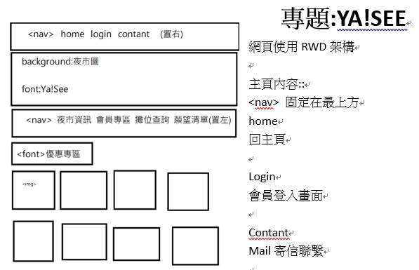
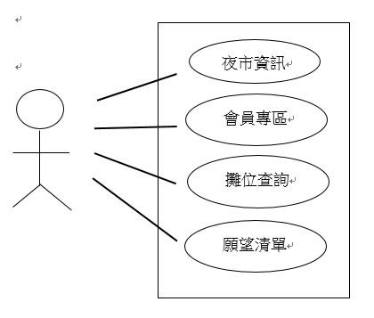

# 專案名稱:夜See

## 組別:第三組

## 成員:0424006 倪慧芳 0424034 陳姵瑄

### 指導老師:曾守正

##### 9/21

##### 10/5

#### 功能性需求:
##### 1. 店家資訊
##### 2. GPS定位
##### 3. APP+Beacon

#### 非功能性需求:
##### 1. 店家可自行更新攤位資訊
##### 2. 用戶更新與系統呈現不應超過2秒
##### 3. 系統可自動過濾粗俗字眼的評價

### 2017/10/12甘特圖

### 網頁架構

### 使用案例圖

### 期末報告

